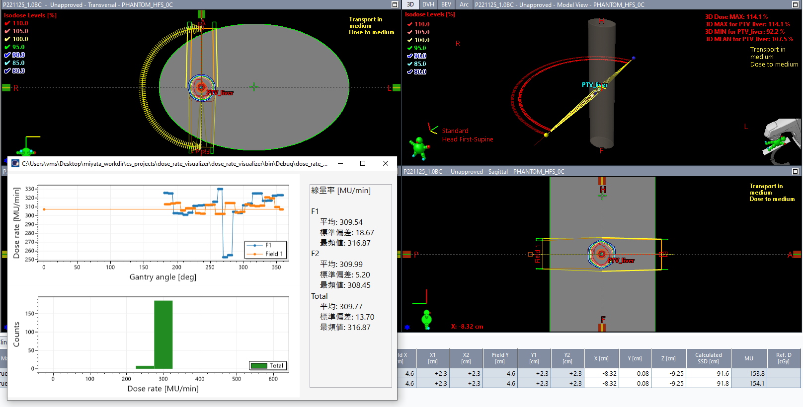

# dose_rate_visualizer_esapi_v15_5

ESAPI Binary Plugin to visualize beam dose rate.

Created with ESAPI v16.1.

This is in the process of i8n.

## How to use

1. Starting this script, the dose rate for each control point for each beam is calculated and plotted.

   

The mean, standard deviation, and mode of dose rate are also calculated and displayed.

**Note that the gantry angle of 0 degrees is plotted on the far left regardless of CW or CCW, an issue that needs to be corrected.**

## LICENSE

Released under the MIT license.

No responsibility is assumed for anything that occurs with this software.

See [LICENSE](https://github.com/akiaji-k/plan_checker_gui_esapi_v15_5/blob/main/LICENSE) for further details.