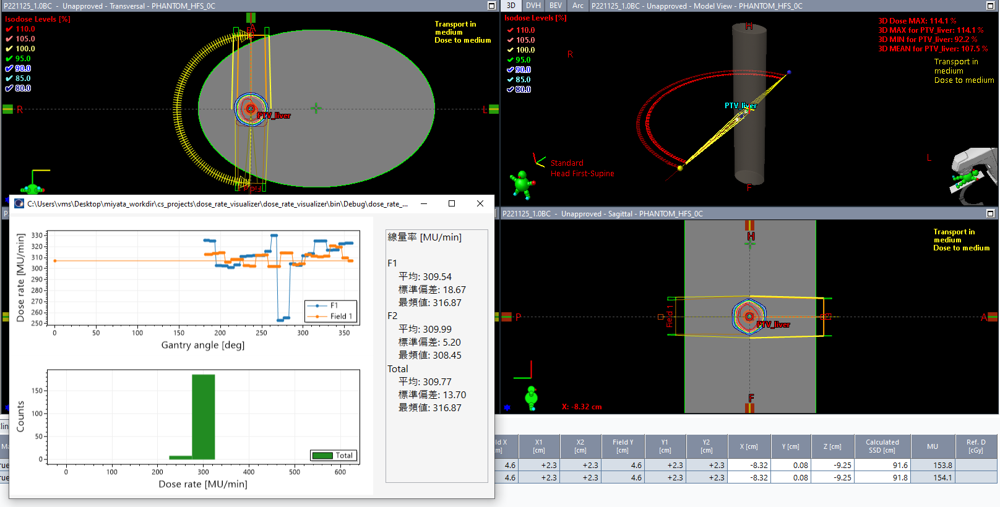

# dose_rate_visualizer

ビームの線量率を可視化するためのESAPI Binary Pluginです。

ESAPI v16.1で作成されています。

本ソフトウェアの多言語への翻訳は途中です。

## 使用方法

1. このスクリプトを起動すると、各ビームの各コントロールポイントの線量率が計算され、プロットされます。

   

**CW, CCWに依らずガントリ角度0度が左端にプロットされるのは、修正すべき課題です。**

## LICENSE

MIT ライセンスで公開されています。

本ソフトウェアで発生したことについて、いかなる責任も負いません。

詳細は [LICENSE](https://github.com/akiaji-k/4DCT_namer/blob/main/LICENSE) をご確認ください。

